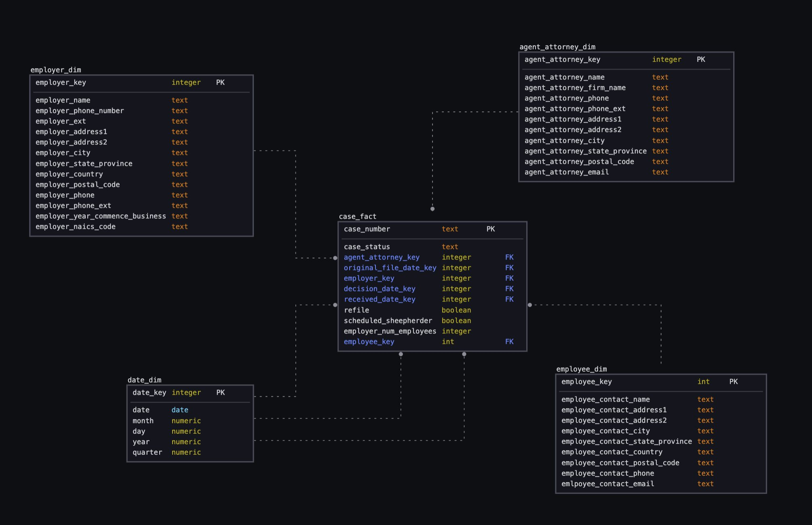

# Data Modeling 
The purpose of this project is to be able to develop a star schema using Python and SQL.

## Process Components

- Dataset
- Data Modeling (SQL)
- ETL (Python/SQL)
- Database Connection
- Issues

### Dataset
Per the U.S. Department of Labor (https://www.dol.gov/agencies/eta/foreign-labor/performance)

Disclosure data consists of selected information extracted from nonimmigrant and immigrant application tables within the Office of Foreign Labor Certification's case management systems. The data sets provide public access to the latest quarterly and annual data in easily accessible formats for the purpose of performing in-depth longitudinal research and analysis. Each data set is cumulative for the fiscal year, containing unique records identified by the applicable OFLC case number based on the most recent date a case determination decision was issued. Information that appears in these records is provided by employers and system-generated metadata, such as received dates and decision dates. Any typographical errors or other data anomalies (e.g., incomplete or blank data fields, etc.) may be due to internal data entry or other external customer errors in completing and submitting the applications for processing.

### Data Modeling

The data modeling component of this project is focused on a start schema approach with one fact table and four dimension tables.

Fact:
- Case

Dimension:
- Employer
- Agent Attorney
- Date
- Employee

### ETL (Python/SQL)
There is a very simple form of ETL being performed here. 
The following are the actions being done for extraction transformation and load:

#### Extract
- reading in csv from local storage

#### Transform
- renaming columns to all lowercase for readability on the user's end (no one likes to type in all caps)
- subsetting the data by removing columns and only keeping columns adding value to this use case
- performing a data quality check for nulls and then outputting that information

#### Load
- performing bulk insert into database table

### Database Connection
Postgresql localhost connection using psycopg2.
Connection code and some load code is provided.

### Issues
There were some issues in this process. Mainly the dimension level establishing what qualified as a unique dimension. This led to some trouble in the creation of the fact table because of the joins required to bring in that id. I did the joins on only a subset of columns from what I had identified as the primary key in the row_number() window function. Somehow there was some functionality to it.
The final issue was in creating the fact table and the dates.
What needs to be done is some string formatting and date conversion to make those dates match up but that sort of transformation is out of the scope of learning from this project.

The purpose of this project was to be able to develop a star schema using python and SQL. This gives a high level overview as well as some in-depth steps on how to develop a normalized dimensional star schema model.
